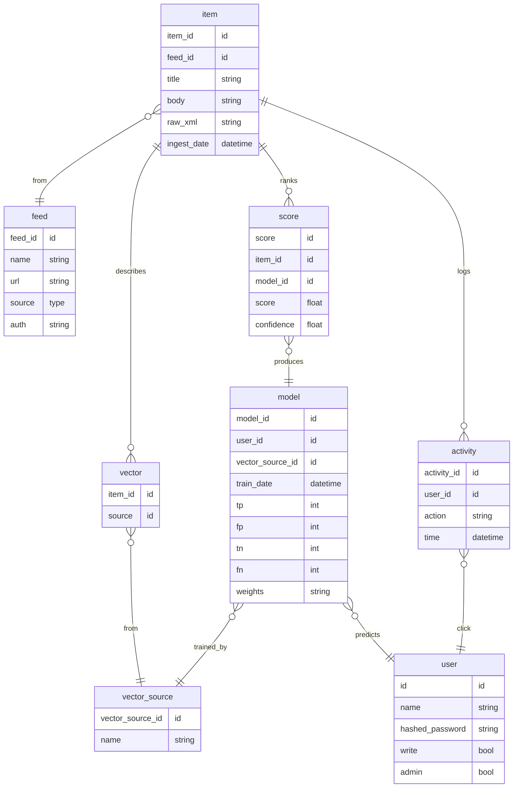

# blinder

## Sites to support

* [ ] youtube
* [ ] reddit
* [ ] facebook
* [ ] X
* [ ] twitch
* [ ] amazon? (search results)
* [ ] mastadon
* [ ] lemmy
* [ ] instagram
* [ ] tik tok
* [ ] pinterest
* [ ] linkedin
* [ ] Adult media
* [ ] threads

### Database Design

## Redis for db?

