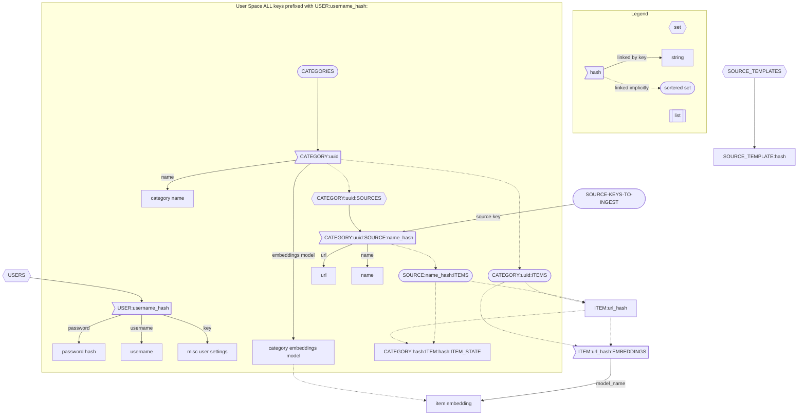

# Aggy 🐊
**Your personal content curator.** A self-hostable, personalized content aggregator where **your preferences** are what matter most. Imagine your own private Reddit, but without the clutter, focused solely on what you care about.

## Why Use Aggy?

Let’s say you’re fascinated by alligators. You hop between platforms to follow alligator-related creators and subreddits. Every once in a while, you see a post about crocodiles, Argh! Aggy solves this problem by bringing **all your content into one place** and sorting it based on how relevant it is to you. When you're in the mood for alligator facts, you won’t have to sift through crocodile content—Aggy does the filtering for you.

Aggy works for any type of content. Whether it’s specific animals, hobbies, news, or entertainment, Aggy curates your source to match **your interests**.

## How does Aggy work?

### Bringing all your content into one place

Aggy currently supports:

- **RSS sources** via templates powered by [RSS-Bridge](https://github.com/RSS-Bridge/rss-bridge)

Upcoming integrations:

- **Email newsletters** (Sign up for your favorite newsletters using a custom Aggy email and filter out the noise)
- **Podcasts** (Currently available only via RSS; direct search support is on the way)

When Aggy finds new content, it analyzes metadata and determines how relevant it is based on your past interactions, making sure the most meaningful content rises to the top.

### Understanding your preferences

Aggy uses **content embeddings** to understand the types of content you enjoy. As you browse, like, filter, or provide sourceback, Aggy fine-tunes your source so you get more of what you love without relying on generic algorithms or trends.

## Features

### Available now:

- **RSS source support** with predefined templates for faster setup
- **Embedding generation** for text to improve content relevance

### In the works:

- **URL remapping** (e.g., YouTube to [Invidious](https://invidious.io/))
- **Embedding generation for images**
- **User sourceback-based model training** (Aggy gets smarter with your input)
- **Duplicate post detection** (Recognizes similar content across different sources and only shows the best)
- **Alternate sorting options** (Best, Worst, Newest, Oldest)
- **Recommendation transparency** (Learn why a piece of content was recommended to you)
- **Semantic filters** (E.g., hide political content)
- **NSFW content controls** (Blur or block inappropriate images)

## Contributing

We’re still working on a contribution guide, but if you have ideas, we’d love your help!

## License

[LICENSE (Apache 2.0)](./LICENSE)

# TODO
- [ ] generate embeddings for images
- [ ] train models on user data + embeddings
- [ ] use embeddings to help decide which image would be the best preview image
- [ ] fix reddit albums getting very low res thumbnails
- [ ] de-duplicate posts where possible (same title, picture(maybe based on embeddings?), link after redirects)
- [ ] Add RSS bridge (or similar) to docker compose setup (use this to template rss sources?)
- [ ] API for templated rss sources

### Database Design

