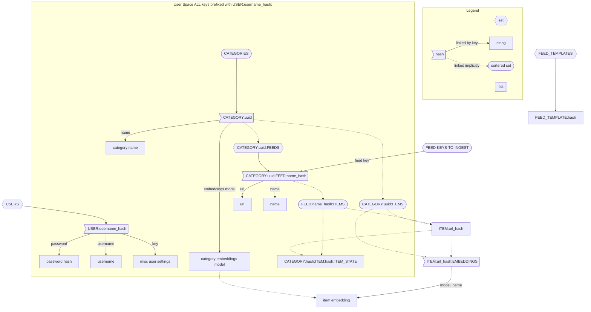

# Aggy 🐊

A self-hostable personalized content aggregator. It's like your own private reddit instance where the only vote that matters is yours.

## Why use Aggy?

Say you're into electric vehicles, but not general cars. You browse /r/mechanics but there's lots of popular posts in the subreddit that don't interest you. So you hop over to youtube and find a few videos you like but your favorite channels are posting lots of different content that isn't always your taste. Aggy is designed to solve this problem; it brings all your content into one place sorted by relevance to you. That means when you want EV-related content; you aren't sorting through the junk to find what you want.

## How does Aggy work?

#### How does Aggy get all my content in one place?

Aggy curently supports:
- RSS feeds with templates built on top of [RSS-Bridge](https://github.com/RSS-Bridge/rss-bridge)

Aggy will soon support:
- Email (sign up for news letters with an Aggy email and skip the spam)
- Podcasts (currently not searchable and only via RSS feeds)

When Aggy gets a new item in a feed it builds out some basic metadata and decides how likely it is that you will want to see it.

#### How does Aggy know what I like?

Aggy leverages [embeddings](https://stackoverflow.blog/2023/11/09/an-intuitive-introduction-to-text-embeddings/) to understand your content semantically. As you browse your content it learns what you like based on your clicks, likes, filters, and feedback.

## Features

### Available

- RSS feed support + predefined RSS feed templates
- Embedding generation for text

### Planned

- Automatically re-map URLs (i.e. youtube to [invidious](https://invidious.io/))
- Embedding Generation for images
- Train models on user feedback
- Duplicate post recognition (detect when very similar content is posted in seperate places and take just the best)
- Alternate sort orders (Best, Worst, Newest, Oldest)
- Reccomendation report (Why am I seeing this?)
- Semantic filters (Don't show me political content)
- Blur or block NSFW images/content

## Contributing

We don't have a contributing guide yet, maybe you could help us with that?

## License

[./LICENSE](LICENSE (Apache 2.0))

# TODO
- [ ] generate embeddings for images
- [ ] train models on user data + embeddings
- [ ] use embeddings to help decide which image would be the best preview image
- [ ] fix reddit albums getting very low res thumbnails
- [ ] de-duplicate posts where possible (same title, picture(maybe based on embeddings?), link after redirects)
- [ ] Add RSS bridge (or similar) to docker compose setup (use this to template rss feeds?)
- [ ] API for templated rss feeds

### Database Design

