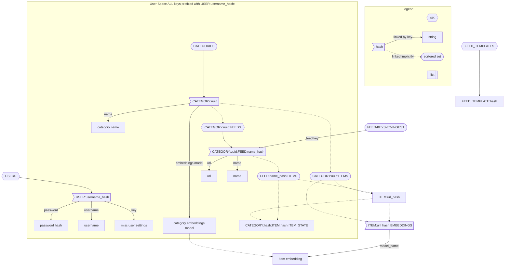

# aggy

## TODO
- [x] test out valkey
- [x] build docker container for webui
- [x] setup main instance of webui and API
- [x] setup script to allow locally running the webui within docker container with api
- [x] move todo items to github issues
- [x] route testing
- [x] add license
- [x] pagination for any api returning list
- [ ] user interactions (opens, up and down votes)
- [ ] save preview image(s)
- [ ] setup embeddings container
- [ ] generate embeddings text
- [ ] generate embeddings for images
- [ ] train models on user data + embeddings
- [ ] use embeddings to help decide which image would be the best preview image
- [ ] fix reddit albums getting very low res thumbnails
- [ ] de-duplicate posts where possible (same title, picture(maybe based on embeddings?), link after redirects)
- [ ] Add RSS bridge (or similar) to docker compose setup (use this to template rss feeds?)
- [ ] API for templated rss feeds

### Database Design

