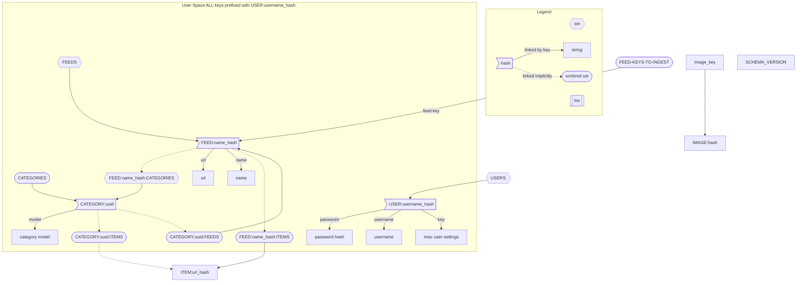

# blinder

## TODO
- [ ] make side menu useable
    - [ ] add an edit/delete button/route for feeds
    - [ ] when adding feed suggest categories/autofill
- [ ] pagination
- [ ] add published date, favicon and metadata to items
- [ ] add feed management + stats(opens, % open, new since last open)
- [ ] collect user data (opens, up and down votes)
- [ ] break image collection into seperate microservice
- [ ] create embeddings microservice for text/images
- [ ] create microservice for training models on embeddings and user data
- [ ] find most relevant image on a website using embeddings?
- [ ] fix reddit albums getting very low res thumbnails
- [ ] de-duplicate posts where possible (same title, picture(maybe based on embeddings?), link after redirects)

### Database Design

